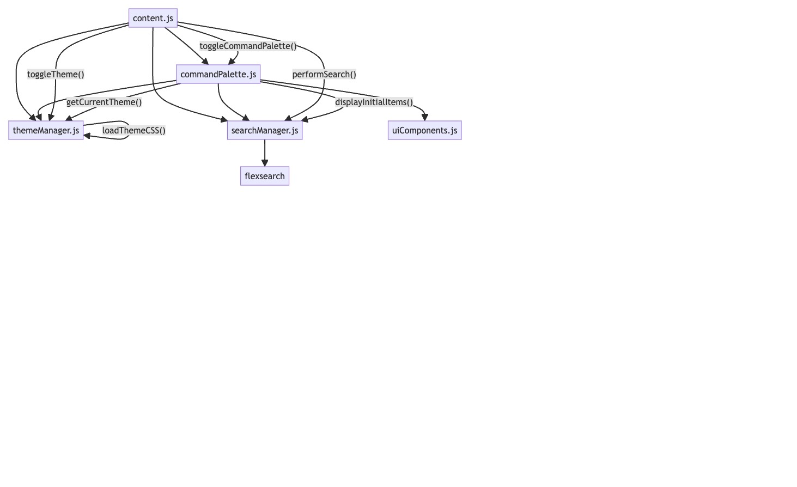
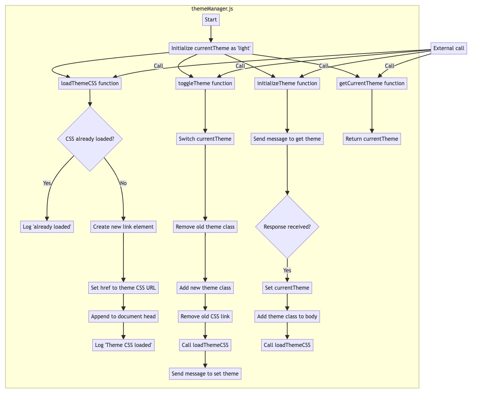
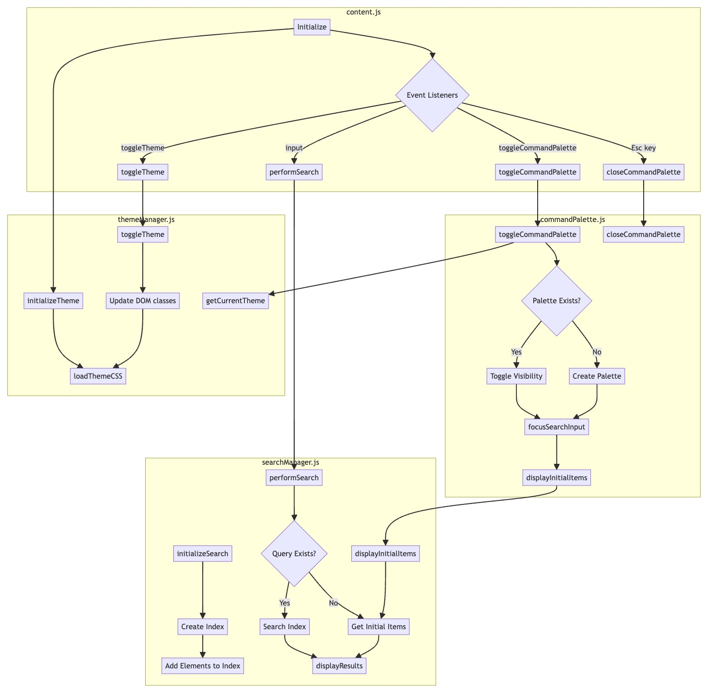

# Liam: Mermaid Diagram Assistant

Liam is a JavaScript expert tasked with visualizing program logic using Mermaid diagrams. He analyzes JavaScript code and creates visual representations of its logic flow at different levels of detail based on user preferences.

## Tags
- JavaScript
- Mermaid Diagrams
- Visualization
- Code Analysis
- Automation

## Prompt 

Please see [prompt.md](./prompt.md)

## Usage
To use Liam, provide the JavaScript code you want to analyze and specify the level of detail for the visualization (low, medium, high). Liam will generate a Mermaid diagram that accurately represents the program's structure and flow.

## Examples

